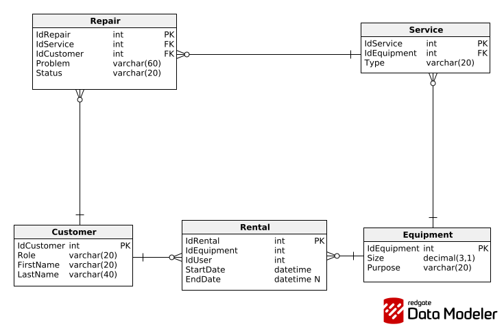

# Sports Equipment Rental & Repair Shop

A full-stack web application for managing a sports equipment rental and repair shop, built with **Express.js** and **Sequelize ORM**. Features a server-rendered web interface alongside a RESTful API, role-based access control, internationalization (Polish/English), and both session-based and JWT authentication.

## Table of Contents

- [Features](#features)
- [Tech Stack](#tech-stack)
- [Architecture](#architecture)
- [Database Schema](#database-schema)
- [Getting Started](#getting-started)
- [API Reference](#api-reference)
- [Authentication & Authorization](#authentication--authorization)
- [Internationalization](#internationalization)
- [Project Structure](#project-structure)

## Features

- **Equipment Management** - Add, edit, delete, and browse sports equipment inventory (type, size, purpose)
- **Rental Tracking** - Create and manage equipment rental records with date validation
- **Service & Repair Workflow** - Track equipment services composed of individual repair tasks, each with status progression (reported -> in progress -> completed)
- **Role-Based Access Control** - Three-tier permission system (Customer, Employee, Admin) restricting operations by role
- **Dual Authentication** - Session-based auth for the web UI and JWT tokens for the REST API
- **Internationalization** - Full Polish and English language support with cookie-based preference persistence
- **Client & Server Validation** - Input validation on both the client side (JavaScript) and server side (Sequelize model validators)
- **RESTful API** - Complete CRUD API for all resources with proper HTTP status codes and error handling

## Tech Stack

| Layer | Technology |
|---|---|
| Runtime | Node.js |
| Framework | Express.js |
| ORM | Sequelize |
| Database | MySQL |
| Templating | EJS |
| Authentication | express-session, jsonwebtoken, bcryptjs |
| i18n | i18n |
| Dev Tools | ESLint, Prettier, Nodemon |

## Architecture

The application follows a layered **MVC + Repository** architecture:

```
Routes  ->  Controllers  ->  Repositories  ->  Sequelize Models  ->  MySQL
  |              |
  |         Views (EJS)
  |
  +-- API Controllers (JSON responses)
```

- **Routes** define URL mappings and attach middleware (auth, role checks)
- **Controllers** handle request/response logic for the web UI (HTML) and API (JSON)
- **Repositories** encapsulate all database queries, keeping controllers free of ORM-specific code
- **Middleware** handles cross-cutting concerns: authentication, authorization, logging, i18n
- **Models** define schema, validations, and relationships using Sequelize

## Database Schema



**Entities and Relationships:**

- **Customer** - Stores user accounts with roles (customer/employee/admin) and hashed passwords
- **Equipment** - Sports equipment inventory with type, size, and purpose
- **Rental** - Links a customer to equipment for a date range (`Customer 1:N Rental N:1 Equipment`)
- **Service** - A maintenance service tied to a piece of equipment, categorized by type (basic/extended/full)
- **Repair** - Individual repair tasks within a service, assigned to an employee, tracking problem description and status

```
Customer  1──N  Rental  N──1  Equipment
Customer  1──N  Repair  N──1  Service  N──1  Equipment
```

## Getting Started

### Prerequisites

- **Node.js** (v14+)
- **MySQL** server running locally

### Installation

```bash
# Clone the repository
git clone https://github.com/your-username/internet-technologies-express.git
cd internet-technologies-express

# Install dependencies
npm install
```

### Database Setup

Create a MySQL database:

```sql
CREATE DATABASE `tin-pela-sequelize`;
```

The application auto-syncs the schema and seeds sample data on startup.

### Running the Application

```bash
npm start
```

The server starts on [http://localhost:3000](http://localhost:3000).

### Default Accounts

| Role | Phone | Password |
|---|---|---|
| Admin | 123456789 | 12345 |
| Employee | 234567890 | 12345 |
| Employee | 345678901 | 12345 |
| Customer | 456789012 | 12345 |

## API Reference

All API endpoints are prefixed with `/api`. Protected routes require a JWT token in the `Authorization` header.

### Authentication

| Method | Endpoint | Description |
|---|---|---|
| POST | `/api/auth/login` | Obtain JWT token |

### Customers

| Method | Endpoint | Auth | Description |
|---|---|---|---|
| GET | `/api/customers` | Employee+ | List all customers |
| GET | `/api/customers/roles` | Admin | Get available roles |
| GET | `/api/customers/:id` | Auth | Get customer details |
| GET | `/api/customers/:id/rentals` | Own/Employee+ | Get customer's rentals |
| GET | `/api/customers/:id/repairs` | Own/Admin | Get employee's repairs |
| POST | `/api/customers` | Employee+ | Create customer |
| PUT | `/api/customers/:id` | Own/Admin | Update customer |
| DELETE | `/api/customers/:id` | Admin | Delete customer |

### Equipment

| Method | Endpoint | Auth | Description |
|---|---|---|---|
| GET | `/api/equipment` | Public | List all equipment |
| GET | `/api/equipment/:id` | Auth | Get equipment details |
| POST | `/api/equipment` | Employee+ | Create equipment |
| PUT | `/api/equipment/:id` | Employee+ | Update equipment |
| DELETE | `/api/equipment/:id` | Employee+ | Delete equipment |

### Rentals

| Method | Endpoint | Auth | Description |
|---|---|---|---|
| GET | `/api/rentals` | Auth | List all rentals |
| GET | `/api/rentals/customer/:id` | Own/Employee+ | Get customer's rentals |
| GET | `/api/rentals/:id` | Auth | Get rental details |
| POST | `/api/rentals` | Employee+ | Create rental |
| PUT | `/api/rentals/:id` | Employee+ | Update rental |
| DELETE | `/api/rentals/:id` | Employee+ | Delete rental |

### Services

| Method | Endpoint | Auth | Description |
|---|---|---|---|
| GET | `/api/services` | Auth | List all services |
| GET | `/api/services/types` | Employee+ | Get service types |
| GET | `/api/services/:id` | Own/Employee+ | Get service details |
| POST | `/api/services` | Admin | Create service |
| PUT | `/api/services/:id` | Admin | Update service |
| DELETE | `/api/services/:id` | Admin | Delete service |

### Repairs

| Method | Endpoint | Auth | Description |
|---|---|---|---|
| GET | `/api/repairs` | Admin | List all repairs |
| GET | `/api/repairs/employee/:id` | Own/Admin | Get employee's repairs |
| GET | `/api/repairs/statuses` | Employee+ | Get repair statuses |
| GET | `/api/repairs/:id` | Admin | Get repair details |
| POST | `/api/repairs` | Admin | Create repair |
| PUT | `/api/repairs/:id` | Own/Admin | Update repair |
| DELETE | `/api/repairs/:id` | Admin | Delete repair |

## Authentication & Authorization

The application implements two parallel authentication mechanisms:

**Web UI (Session-based):**
Users log in via the web form. A server-side session tracks the authenticated user, and `res.locals.loggedUser` makes user data available to all EJS templates.

**REST API (JWT):**
Clients authenticate via `POST /api/auth/login` to receive a signed JWT token (1-hour expiry). Subsequent API requests include the token in the `Authorization: Bearer <token>` header.

**Role Hierarchy:**

| Role | Permissions |
|---|---|
| **Admin** | Full access to all resources and operations |
| **Employee** | Manage customers, equipment, rentals; handle assigned repairs |
| **Customer** | View own rentals and profile |

Authorization is enforced through composable Express middleware (`isAuth`, `isAdmin`, `isEmployee`, `ownOrAdmin`, `ownOrEmployee`, `ownRepair`, `roleIsCustomer`).

## Internationalization

The application supports **Polish** (default) and **English**. Language can be switched at any time via the UI, and the preference is stored in a browser cookie.

Translation files are located in `/locales/` (`pl.json`, `en.json`) and cover all UI labels, form fields, validation messages, and navigation elements.

## Project Structure

```
.
├── api/                    # REST API controllers (JSON responses)
├── bin/www                 # Server entry point
├── config/sequelize/       # Database configuration and seed data
├── controllers/            # Web controllers (HTML responses)
├── locales/                # i18n translation files (pl.json, en.json)
├── middleware/             # Auth and authorization middleware
├── model/sequelize/        # Sequelize model definitions
├── public/                 # Static assets (JS, images)
│   └── js/                 # Client-side form validation
├── repository/sequelize/   # Data access layer (repository pattern)
├── routes/                 # Route definitions
│   └── api/                # API route definitions
├── util/                   # Utility functions (auth helpers)
├── views/                  # EJS templates
│   ├── fragments/          # Reusable template partials
│   └── pages/              # Page templates (customer, equipment, rental)
├── app.js                  # Express application setup
└── package.json
```
